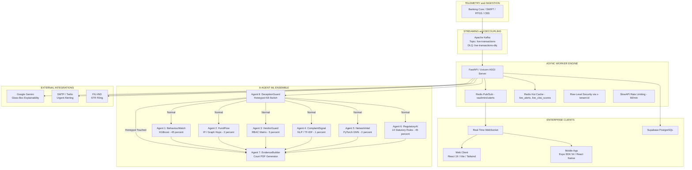

# VaultMind Enterprise

> **Real-Time Insider Threat Detection, Inductive Graph Forensics & Active Deception Defense Platform**
>
> Built for Banking & High-Security Financial Organizations

[](https://fastapi.tiangolo.com)
[](https://react.dev)
[](https://expo.dev)
[](https://kafka.apache.org)
[](https://redis.io)
[](https://pytorch.org)
[](https://xgboost.readthedocs.io)
[](https://supabase.com)
[](https://docker.com)

---

## Table of Contents

- [Overview](#overview)
- [System Architecture](#system-architecture)
- [Technology Stack](#technology-stack)
- [8-Agent ML Ensemble Pipeline](#8-agent-ml-ensemble-pipeline)
- [Project Structure](#project-structure)
- [Prerequisites](#prerequisites)
- [Environment Configuration](#environment-configuration)
- [Getting Started](#getting-started)
- [API Reference](#api-reference)
- [Web Client](#web-client)
- [Mobile App](#mobile-app)
- [Demo and Synthetic Data](#demo-and-synthetic-data)
- [Pre-Transaction Preventative Gateways](#pre-transaction-preventative-gateways)
- [Security Architecture](#security-architecture)
- [Testing and Verification](#testing-and-verification)
- [License and Compliance](#license-and-compliance)

---

## Overview

**VaultMind** is an enterprise-grade, event-driven platform that detects insider threats, money laundering patterns, and fraudulent banking transactions in real time. It combines an **8-agent ensemble ML pipeline** (XGBoost behavioral analysis + PyTorch GraphSAGE network inference + deterministic regulatory rule engines) with an **active deception defense layer** (honeypot traps) and a **human-in-the-loop active learning feedback system**.

### What Makes VaultMind Different

- **8-Agent Parallel Ensemble** — Transactions are scored by 8 specialized agents in parallel, producing a weighted Composite Behavioural and Structural Integrity (CBSI) score
- **Inductive Graph Neural Network** — PyTorch GraphSAGE generates embeddings for accounts on the fly — no retraining needed when new accounts appear
- **Active Deception (Honeypots)** — Decoy bank accounts act as tripwires — any access triggers an instant kill-switch (CBSI = 100) and terminal isolation
- **Court-Admissible Evidence** — Auto-generates tamper-proof PDF dossiers compliant with Section 63 of Bharatiya Sakshya Adhiniyam (BSA) 2023 and PMLA 2002, with SHA-256 hash chains and QR verification
- **Human-in-the-Loop Learning** — Analyst CONFIRM / FALSE_ALARM feedback is queued for model retraining, enabling continuous self-improvement
- **Multi-Tenant Row-Level Security** — Every database query is tenant-isolated via PostgreSQL RLS policies enforced through x-tenant-id headers
- **Real-Time Streaming** — Apache Kafka ingestion to Redis Pub/Sub broadcasting to WebSocket delivery to all connected clients in under 2 seconds

---

## System Architecture



### Data Flow

1. Banking transactions arrive via **Kafka** topic `live-transactions` (or in-memory CSV stream fallback)
2. The **Kafka Consumer Worker** deserializes and dispatches each transaction to the **MasterOrchestrator**
3. **Agent 8 (DeceptionGuard)** runs first — if a honeypot account is touched, CBSI is immediately set to 100 and the terminal is isolated
4. Otherwise, **Agents 1-6** execute in parallel via `asyncio.gather`, each returning a sub-score
5. Sub-scores are combined into a **weighted CBSI composite** (Agent 1: 45%, Agent 6: 45%, others: 10% combined)
6. If CBSI >= 80, **Agent 7 (EvidenceBuilder)** auto-generates a court-admissible PDF dossier
7. The scored result is published to **Redis Pub/Sub** and broadcast to all **WebSocket** clients in real time
8. Analysts review alerts and submit CONFIRM / FALSE_ALARM feedback which is queued for model retraining

---

## Technology Stack

### Backend (server/)

| Component | Technology | Purpose |
|:---|:---|:---|
| API Framework | FastAPI + Uvicorn | High-performance async REST and WebSocket server |
| ML - Behavioral | XGBoost + Scikit-Learn | 7-feature employee behavioral anomaly scoring |
| ML - Graph | PyTorch + GraphSAGE | Inductive graph neural network for topological money flow analysis |
| Generative AI | Google Gemini 2.0 Flash | Natural-language glass-box explainability for analysts |
| Message Streaming | Confluent Kafka | Real-time transaction ingestion with DLQ and exponential backoff retries |
| Cache and Pub/Sub | Redis | Hot alert cache, 7-day velocity tracking, cross-pod WebSocket relay |
| Database | Supabase (PostgreSQL) | Multi-tenant persistent storage with Row-Level Security |
| Auth and Security | JWT (HS256) + bcrypt | RBAC, HttpOnly cookies, brute-force lockout |
| Forensic Reports | ReportLab + qrcode + Pillow | Court-admissible PDF evidence with SHA-256 integrity chains |
| Rate Limiting | SlowAPI | IP-based request throttling (default 60/min) |

### Web Client (client/)

| Component | Technology | Purpose |
|:---|:---|:---|
| Framework | React 19 + Vite 8 | Fast SPA with HMR |
| Styling | Tailwind CSS 4 | Utility-first responsive design |
| State Management | Zustand v5 | Lightweight reactive global store |
| Charts | Recharts v3 | AreaChart, PieChart, RadialBarChart for dashboard analytics |
| Graph Visualization | react-force-graph-2d | Interactive force-directed fund flow graph |
| Animations | Framer Motion v12 | Smooth UI transitions and modal animations |
| Realtime | Supabase JS Client | PostgreSQL change notifications for evidence log updates |

### Mobile App (mobile/)

| Component | Technology | Purpose |
|:---|:---|:---|
| Framework | Expo SDK 54 + React Native 0.81 | Cross-platform native mobile app (iOS / Android) |
| Navigation | Expo Router 6 | File-based routing with bottom tab navigator |
| TypeScript | Strict mode | Full type safety across all components |
| SVG Rendering | react-native-svg v15 | India threat map, fund flow graphs, radar sweeps |
| Animations | react-native-reanimated v4 | Native-thread 60fps animations |
| Secure Storage | expo-secure-store | iOS Keychain / Android Keystore for JWT tokens |

### Infrastructure

| Component | Technology | Purpose |
|:---|:---|:---|
| Containerization | Docker + Docker Compose | 6-service orchestration (Kafka, Zookeeper, Redis, Backend, Web, Producer) |
| Reverse Proxy | Nginx Alpine | SPA serving, API/WebSocket proxying, path-based routing |
| Offline Builds | Pre-bundled Python wheels | Air-gapped Docker builds without external PyPI access |

---

## 8-Agent ML Ensemble Pipeline

Each inbound transaction is processed through a coordinated ensemble of 8 specialized detection agents:

| No. | Agent | Method | Weight | Key Capability |
|:---:|:---|:---|:---:|:---|
| 1 | **BehaviourWatch** | XGBoost + Z-Score | 45% | 7-feature behavioral profiling: amount, dwell time, records accessed, login hour, velocity metrics. Includes CIBIL score penalty and channel entropy detection. |
| 2 | **FundFlow** | IP Reputation + Graph Hops | 2% | Tor exit node detection, proxy CIDR matching, 3-hop graph cycle/smurfing detection |
| 3 | **VendorGuard** | RBAC Matrix | 5% | Role x action-type access control validation, historical transaction limit deviation |
| 4 | **ComplaintSignal** | NLP / TF-IDF | 1% | Distress lexicon matching (benami, pmla, coercion keywords), semantic cluster amplification |
| 5 | **NetworkIntel** | PyTorch GraphSAGE GNN | 2% | 2-layer SAGEConv edge classifier with inductive node enrollment for unseen accounts |
| 6 | **RegulatoryAI** | 14 Statutory Rules | 45% | RBI Master Directions, PMLA 2002, FEMA, Benami Prohibition Act compliance |
| 7 | **EvidenceBuilder** | ReportLab PDF | - | Auto-generates court-admissible dossiers (BSA 2023 Section 63) with QR codes and SHA-256 chains. Triggered when CBSI >= 80. |
| 8 | **DeceptionGuard** | Honeypot Registry | - | Kill-switch. If decoy account is accessed, CBSI is set to 100 and terminal is instantly isolated. Runs before all other agents. |

### CBSI Scoring Formula

```
CBSI = (Agent1 x 0.45) + (Agent2 x 0.02) + (Agent3 x 0.05) + (Agent4 x 0.01) + (Agent5 x 0.02) + (Agent6 x 0.45)
```

### Risk Tier Classification

| CBSI Range | Tier | Action |
|:---:|:---:|:---|
| >= 70 | CRITICAL | Auto-generate evidence PDF, alert auditor, flag for STR |
| 50-69 | HIGH | Escalate to senior analyst, enhanced monitoring |
| 30-49 | WATCH | Flag for review, passive monitoring |
| < 30 | NORMAL | Pass through, log only |

---

## Project Structure

```
IDEA_FINALE/
│
├── server/                              # FastAPI Backend and ML Engine
│   ├── main.py                          # App entry point (Uvicorn ASGI)
│   ├── requirements.txt                 # Full Python dependencies (includes PyTorch)
│   ├── requirements-docker.txt          # Lean Docker dependencies (CPU inference only)
│   ├── .env.example                     # Environment variable template
│   ├── api/
│   │   ├── api_server.py                # Core fraud monitoring and dashboard endpoints
│   │   ├── auth_routes.py               # JWT auth, login, signup, session management
│   │   └── feedback_routes.py           # Human-in-the-loop active learning routes
│   ├── core/
│   │   ├── master_orchestrator.py       # 8-agent ensemble coordinator and CBSI scoring
│   │   ├── ml_models.py                 # Singleton model loader (XGBoost, GraphSAGE)
│   │   ├── auth.py                      # JWT generation, bcrypt hashing, RBAC guards
│   │   ├── db_connections.py            # Supabase + Redis connection factory
│   │   ├── models.py                    # SQLAlchemy ORM (FraudAlert, Tenant, EvidenceLog)
│   │   ├── historical_state.py          # 7-day moving averages, graph adjacency
│   │   ├── maker_checker.py             # IP collision detection for dual-approval fraud
│   │   ├── notifier.py                  # SMTP email and Twilio SMS alerts
│   │   ├── pre_tx_gateway.py            # Preventative interlocks and WORM audit logging
│   │   └── secrets_config.py            # Centralized secrets validation and masking
│   ├── Agents/                          # Individual agent implementations
│   ├── models/                          # Serialized ML artifacts (.pkl, .pth, .json)
│   ├── services/
│   │   └── kafka_consumer_service.py    # Kafka worker with DLQ and retry logic
│   ├── evidence_output/                 # WORM JSONL log, PDF dossiers, STR reports
│   └── data/Testing_data/              # Demo CSV datasets
│
├── client/                              # React 19 Web Dashboard
│   ├── package.json                     # React 19 + Vite 8 + Tailwind 4
│   ├── vite.config.js                   # Dev proxy config for API/WS
│   ├── .env.example                     # Supabase public credentials
│   └── src/
│       ├── App.jsx                      # Master SPA router and layout
│       ├── store.js                     # Zustand global state
│       ├── apiService.js                # Authenticated HTTP client (cookie-based)
│       ├── hooks/useWebSocketAlerts.js  # WS connection with exponential backoff
│       ├── components/                  # KpiCard, WorldMap, FundFlowGraph, LoginPage, etc.
│       └── views/                       # Dashboard, Roster, Profile, Evidence, etc.
│
├── mobile/                              # Expo SDK 54 Mobile App
│   ├── package.json                     # Expo 54 + React Native 0.81
│   ├── app.json                         # Expo config
│   ├── tsconfig.json                    # Strict TypeScript
│   └── src/
│       ├── app/
│       │   ├── _layout.tsx              # Expo Router root layout
│       │   └── index.tsx                # Main app (auth + bottom tabs)
│       ├── views/                       # Command, Roster, Graph, Decoy, Vault
│       ├── components/                  # CommonUI, ThreatMap, IndiaMapPaths
│       ├── styles/theme.ts              # DARK/LIGHT StyleSheet definitions
│       └── utils/secure_storage.ts      # Hardware-backed secure JWT storage
│
├── scripts/                             # ML Training and DB Utilities
│   ├── train_agent1.py                  # XGBoost + SMOTE + Stratified 5-Fold CV
│   ├── train_agent2.py                  # GraphSAGE GNN + Early Stopping
│   └── inspect_db.py                    # SQLite database inspector
│
├── packages/                            # 84 pre-compiled Python wheels (offline Docker)
├── docker-compose.yml                   # 6-service orchestration
├── Dockerfile.api                       # Backend container (Python 3.10, offline pip)
├── Dockerfile.web                       # Frontend container (Nginx Alpine)
├── nginx.conf                           # Reverse proxy config
├── generate_demo_data.py                # Synthetic data generator (8 fraud scenarios)
└── start_kafka_demo.py                  # Kafka transaction publisher (2s intervals)
```

---

## Prerequisites

| Requirement | Version | Notes |
|:---|:---|:---|
| Python | 3.10+ | Backend server and ML training scripts |
| Node.js | 18+ | Web client and mobile app |
| npm | 9+ | Package management |
| Docker and Docker Compose | Latest | For containerized deployment |
| Supabase Account | - | PostgreSQL database with RLS |
| Redis | 6+ | Auto-provisioned via Docker |
| Apache Kafka | 7.5+ | Auto-provisioned via Docker, optional for local dev |

---

## Environment Configuration

### Backend (server/.env)

Copy the template and fill in your credentials:

```bash
cp server/.env.example server/.env
```

**Required Variables:**

| Variable | Description | Example |
|:---|:---|:---|
| `VAULTMIND_ENV` | Runtime mode | `development` or `production` |
| `SUPABASE_URL` | Supabase project URL | `https://xxxxx.supabase.co` |
| `SUPABASE_KEY` | Supabase service role key | `eyJhbGciOiJIUzI1NiIs...` |
| `JWT_SECRET` | HS256 signing secret | Random 64-char string |
| `JWT_ALGORITHM` | JWT algorithm | `HS256` |
| `JWT_EXPIRE_MINUTES` | Token TTL in minutes | `60` |
| `ENCRYPTION_KEY` | 64-char hex for SHA-256 ledger | `a1b2c3d4...` |
| `GEMINI_API_KEY` | Google Gemini API key | `AIzaSy...` |

**Streaming and Cache (required for real-time features):**

| Variable | Description | Example |
|:---|:---|:---|
| `KAFKA_BROKER` | Kafka bootstrap server | `localhost:9092` or `kafka:29092` |
| `EMBEDDED_KAFKA_CONSUMER` | Run Kafka worker inside FastAPI | `true` or `false` |
| `REDIS_HOST` | Redis hostname | `localhost` or `redis` |
| `REDIS_PORT` | Redis port | `6379` |
| `ALLOWED_ORIGINS` | CORS whitelist (comma-delimited) | `http://localhost:5173,http://localhost:8080` |

**Optional Variables:**

| Variable | Description | Example |
|:---|:---|:---|
| `MODEL_PATH` | Path to ML model artifacts | `./models/` |
| `CLERK_LIMIT` | Max txn limit for Clerk (INR) | `5000000` |
| `MANAGER_LIMIT` | Max txn limit for Manager (INR) | `50000000` |
| `ADMIN_LIMIT` | Max txn limit for Admin (INR) | `500000000` |
| `IT_ADMIN_LIMIT` | Max txn limit for IT Admin (INR) | `0` |
| `SMTP_SERVER` | SMTP server for email alerts | `smtp.gmail.com` |
| `SMTP_PORT` | SMTP port | `587` |
| `SMTP_USER` | SMTP username | `alerts@company.com` |
| `SMTP_PASSWORD` | SMTP password | `app-password` |
| `AUDITOR_EMAIL` | Alert recipient email | `auditor@company.com` |
| `TWILIO_ACCOUNT_SID` | Twilio SID for SMS | `ACxxxxxxxx` |
| `TWILIO_AUTH_TOKEN` | Twilio auth token | `xxxxxxxxx` |
| `TWILIO_FROM_NUMBER` | Twilio sender number | `+1234567890` |
| `AUDITOR_PHONE` | SMS alert recipient | `+91xxxxxxxxxx` |

### Web Client (client/.env)

```bash
cp client/.env.example client/.env
```

| Variable | Description |
|:---|:---|
| `VITE_SUPABASE_URL` | Supabase project URL (public) |
| `VITE_SUPABASE_ANON_KEY` | Supabase anonymous/public key |
| `VITE_API_DOMAIN` | Production API domain (optional) |

### Mobile App

The mobile app configures its backend host at runtime via an in-app **Configure Backend IP** screen. JWT tokens are stored in hardware-backed secure storage (iOS Keychain / Android Keystore).

---

## Getting Started

### Local Development

**1. Backend Server**

```bash
cd server
python -m venv venv
```

```bash
# Windows
venv\Scripts\activate

# macOS / Linux
source venv/bin/activate
```

```bash
pip install -r requirements.txt
cp .env.example .env
# Edit .env with your credentials
python main.py
# Server starts at http://localhost:8000
```

> **Note:** Without Kafka running, the server automatically falls back to in-memory CSV streaming. Use `/api/system/start-stream` to trigger the built-in demo stream.

**2. Web Client**

```bash
cd client
npm install
cp .env.example .env
# Edit .env with Supabase public credentials
```

```bash
npm run dev          # Dev server at http://localhost:5173
npm run build        # Production build to client/dist/
```

> The Vite dev server auto-proxies `/api/` and `/ws/` requests to `http://localhost:8000`.

**3. Mobile App**

```bash
cd mobile
npm install
npx tsc --noEmit     # Verify TypeScript compilation (zero errors)
npm start            # Launch Expo dev tools (iOS / Android / Web)
```

> On first launch, configure the backend IP address via in-app settings.

### Docker Deployment

The full stack deploys with a single command — 6 services orchestrated via Docker Compose:

| Service | Container | Port | Description |
|:---|:---|:---:|:---|
| zookeeper | Confluent ZooKeeper | 2181 | Kafka cluster coordination |
| kafka | Confluent Kafka | 9092 | Message broker |
| kafka-init | One-shot | - | Creates live-transactions topic |
| redis | Redis Alpine | 6379 | Pub/Sub, hot cache, velocity tracking |
| backend | VaultMind API | 8000 | FastAPI + embedded Kafka consumer |
| web | Nginx | 8080 | React SPA + reverse proxy |
| producer | Demo Publisher | - | Publishes txns every 2s to Kafka |

```bash
# 1. Build frontend assets
cd client && npm install && npm run build && cd ..

# 2. Launch the full stack
docker-compose up --build -d

# 3. Verify
docker-compose ps
```

> **Offline Build:** The backend Docker image installs from pre-bundled wheels in `packages/` — no external PyPI access needed (air-gapped environments).

**Access Points:**

- Web Dashboard: http://localhost:8080
- Backend API: http://localhost:8000
- Health Check: http://localhost:8000/

---

## API Reference

### Authentication

| Method | Endpoint | Auth | Description |
|:---:|:---|:---:|:---|
| POST | `/api/auth/signup` | - | Register new employee/analyst |
| POST | `/api/auth/login` | - | Login and receive JWT cookie (5-attempt IP limit) |
| POST | `/api/auth/logout` | - | Clear session cookie |
| GET | `/api/auth/me` | Yes | Current user profile |

### Dashboard and Analytics

| Method | Endpoint | Auth | Description |
|:---:|:---|:---:|:---|
| GET | `/api/dashboard/kpis` | Yes | Aggregate KPIs (scanned, alerts, confirmed, avg CBSI) |
| GET | `/api/dashboard-init` | Yes | Recent scored transactions batch |
| GET | `/api/alerts/latest` | Yes | Top 50 alerts from Redis (sub-ms) |
| GET | `/api/stream/kafka-sim` | Yes | Recent alerts buffer |
| GET | `/api/roster/employees` | Yes | Employee directory with metadata |

### Intelligence and Forensics

| Method | Endpoint | Auth | Description |
|:---:|:---|:---:|:---|
| POST | `/api/explain/{emp_id}` | Auditor | Glass-box AI explanation via Gemini |
| GET | `/api/graph/fundflow` | Yes | Fund-flow graph (nodes + edges) |
| GET | `/api/profile/{emp_id}/history` | Auditor+ | 7-day rolling volume from Redis |
| GET | `/api/deception/honeypots` | Yes | Honeypot registry + breach status |
| GET | `/api/evidence/download` | Auditor+ | Download court-admissible PDF |
| POST | `/api/evidence/file-str` | Auditor | File STR to FIU-IND |

### Analyst Feedback and Active Learning

| Method | Endpoint | Auth | Description |
|:---:|:---|:---:|:---|
| POST | `/api/feedback/{emp_id}` | Auditor+ | CONFIRM (lock + STR) or FALSE_ALARM (recalibrate) |
| POST | `/api/alerts/{alert_id}/feedback` | Auditor+ | Push to retraining queue + Redis broadcast |
| GET | `/api/alerts/retraining-queue` | Auditor+ | Unprocessed feedback awaiting retraining |

### Operations and Control

| Method | Endpoint | Auth | Description |
|:---:|:---|:---:|:---|
| POST | `/api/system/start-stream` | Yes | Start built-in CSV demo stream |
| POST | `/api/orchestrator/scan` | Auditor+ | Manual 8-agent scan for single transaction |
| GET | `/get-next-transaction` | Yes | Fallback polling endpoint |

### WebSocket

| Protocol | Endpoint | Auth | Description |
|:---:|:---|:---:|:---|
| WS | `/ws/alerts` | Cookie/Header | Real-time scored transaction stream. Query-param tokens rejected (WS 1008). |

> **Auth Legend:** Yes = JWT required. Auditor+ = Requires specific RBAC role (auditor, analyst, admin, or manager).

---

## Web Client

The web dashboard is a modular React 19 SPA with 8 feature views:

| View | Description |
|:---|:---|
| **DashboardView** | Live KPI counters, interactive India threat map, alert feed, CBSI trend chart, risk pie chart, channel breakdown |
| **RosterView** | Searchable employee directory with role/risk-tier filters and pagination |
| **ProfileView** | Deep forensic dossier — ForensicTimeline, GlassBoxEngine (AI explanation), BlastRadius (shared-IP contagion), SHAP Simulator (what-if sliders), GNN Threat Node |
| **FundFlowGraph** | Interactive force-directed canvas — click a node for one-click Freeze / Forensic Hold / Evidence Generation |
| **DeceptionView** | Honeypot radar with rotating sweep animation and decoy breach status |
| **EvidenceView** | Evidence vault with Supabase realtime log updates and PDF/STR triggers |
| **ReportsView** | Dossier compiler (PDF/CSV/JSON export) and GNN retrain pipeline |
| **SettingsView** | Stream thresholds, queue limits, webhook configuration |

**State:** Zustand v5 — theme, page routing, transactions buffer, employee cache, evidence logs, incidents.

**Auth:** Backend HttpOnly cookies (vm_token) — no tokens in browser JS. Auto-logout on 401.

**WebSocket:** Custom `useWebSocketAlerts` hook with exponential backoff reconnect (3s, 6s, 12s, 30s cap).

---

## Mobile App

Built with **Expo SDK 54** for field-ready access on iOS and Android:

| Tab | Screen | Description |
|:---|:---|:---|
| Command | CommandView | KPI horizontal scroller, interactive SVG India threat map, critical alerts |
| Roster | RosterView | Employee list with filter pills (role + risk tier) |
| Graph | ProfileView | Animated SVG fund flow graph with selectable nodes |
| Decoy | DeceptionView | Animated radar sweep with honeypot targets |
| Vault | EvidenceView | STR dossier generator and evidence log archive |

**Modals:**

- **ProfileDetailModal** — Slide-up with 4 tabs: Timeline, GlassBox, SHAP, Blast Radius
- **FraudAlertModal** — Auto-popup when incoming CBSI >= 70

**Security:** JWT in iOS Keychain / Android Keystore via expo-secure-store with AsyncStorage fallback.

**Connectivity:** Configurable backend IP. WebSocket with 4s auto-reconnect + fallback HTTP polling every 3s.

---

## Demo and Synthetic Data

### Generate Demo Dataset

```bash
python generate_demo_data.py
```

**Output files:**

- `server/data/Testing_data/historical_warmup_data.csv` — 200 warmup transactions
- `server/data/Testing_data/live_demo_stream.csv` — 400 streaming transactions
- `server/data/Testing_data/employees_master.csv` — 500 synthetic employees
- `server/data/Testing_data/metadata.json` — Run configuration

**Pattern:** 10 normal transactions followed by 1 critical fraud, repeating.

### 8 Rotating Fraud Scenarios

| No. | Scenario | Description |
|:---:|:---|:---|
| 0 | Maker-Checker Collusion | High-value RTGS by Clerk after hours (20:00-23:00) |
| 1 | Midnight Harvest | Bulk export of 20K-50K records by IT Admin at 02:00-04:00 |
| 2 | Toxic NLP | Loan approval with bribery extortion in complaints |
| 3 | Smurfing | Rapid ATM withdrawals below statutory audit thresholds |
| 4 | Ghost Vendor | RTGS wire to unapproved shell accounts |
| 5 | Channel Hopping | Rapid switching across UPI, IMPS, NEFT, RTGS |
| 6 | Privilege Escalation | Clerk executing Manager-level Approve actions |
| 7 | Honeypot Trip | Accessing decoy accounts (ACC_MIRAGE_001, ACC_DECOY_ALPHA) |

### Live Kafka Publisher

```bash
python start_kafka_demo.py
# Publishes 1 transaction every 2s to Kafka in infinite loop
```

### In-Memory Fallback (No Kafka Required)

After logging in, trigger the demo stream via the UI or:

```bash
curl -X POST http://localhost:8000/api/system/start-stream \
  -H "Authorization: Bearer YOUR_JWT_TOKEN"
```

---

## Pre-Transaction Preventative Gateways

5 pre-CBS validation interlocks that block suspicious operations **before** they execute:

| Gateway | Endpoint | What It Prevents |
|:---|:---|:---|
| Mobile Update Guard | `POST /api/gateway/verify-mobile-update` | Dormant account mobile changes without biometric AEPS |
| GSTIN Payout Validator | `POST /api/gateway/verify-gstin-payout` | RTGS/NEFT disbursements to unvalidated GSTN vendors |
| CIF Dedup Guard | `POST /api/gateway/verify-cif-onboarding` | Duplicate CIF via Levenshtein + PAN/Aadhaar hashing |
| IoT Vault Verifier | `POST /api/gateway/verify-iot-cash-deposit` | CBS entries without signed IoT note-counting tokens |
| FIU Webhook | `POST /api/webhooks/fiu-alert` | Ingests cross-bank kickback alerts for FCU investigation |

All gateway events are cryptographically hashed and appended to the **WORM ledger** at `server/evidence_output/worm_security_log.jsonl`.

---

## Security Architecture

| Layer | Implementation |
|:---|:---|
| **Authentication** | JWT (HS256) via HttpOnly/SameSite cookies — never exposed to client JS |
| **Password Storage** | Salted bcrypt hashing. Migration script for legacy plaintext. |
| **Brute Force Protection** | IP-based counter locks after 5 failed login attempts |
| **RBAC** | require_role() guard — auditor, analyst, admin, manager |
| **WebSocket Security** | Auth via cookie/header only. Query-param tokens rejected (WS 1008) |
| **Multi-Tenancy** | PostgreSQL RLS via x-tenant-id header on every query |
| **Secrets Management** | SecretsManager singleton — blocks startup if secrets missing in production |
| **CORS** | Explicit origin whitelist with allow_credentials=True |
| **Maker-Checker Guard** | Redis-cached maker IP (24hr TTL). Same-IP approval triggers HTTP 403 + alert |
| **Path Traversal** | os.path.realpath() validation on evidence downloads |
| **Tamper-Evident Ledger** | Blockchain-style SHA-256 hash chain (previous_hash to block_hash) |
| **WORM Audit Log** | Append-only JSONL with per-entry integrity_hash |
| **Mobile Storage** | iOS Keychain / Android Keystore via expo-secure-store |
| **Rate Limiting** | SlowAPI — 60/min default, 5 attempts on login |

---

## Testing and Verification

**Backend:**

```bash
cd server
python main.py                    # Verify startup without errors
# Health: GET http://localhost:8000/
```

**Web Client:**

```bash
cd client
npm run build                     # Verify production build
npm run dev                       # Dev server with HMR
```

**Mobile:**

```bash
cd mobile
npx tsc --noEmit                  # Zero-error TypeScript check
npm start                         # Expo dev tools
```

**ML Training:**

```bash
# Agent 1: XGBoost
python scripts/train_agent1.py
# Outputs: server/models/agent1_iso_forest.pkl, agent1_scaler.pkl, cv_evaluation_report.json

# Agent 2: GraphSAGE GNN
python scripts/train_agent2.py
# Outputs: server/models/agent2_gnn.pth, account_mapping.pkl
```

**Database:**

```bash
python scripts/inspect_db.py      # List tables, dump first 5 records
```

---

## License and Compliance

Built under strict **SOC 2 Type II** and **Banking Zero-Trust Data Governance** architecture guidelines.

**Regulatory Frameworks Implemented:**

- Reserve Bank of India (RBI) Master Directions
- Prevention of Money Laundering Act (PMLA) 2002
- Foreign Exchange Management Act (FEMA)
- Benami Transactions (Prohibition) Amendment Act
- Bharatiya Sakshya Adhiniyam (BSA) 2023, Section 63 — Digital Evidence Admissibility

All rights reserved.